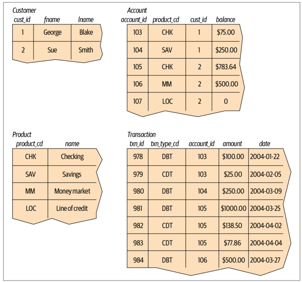
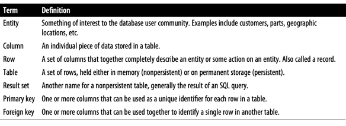

### Introduction to Relational Databases ( Postgresql )
___


#### Questions
> 1. Why you need to store data?
> 2. Where you could store data?
> 3. How to extract useful information from data? ( for ex. from .txt )  
>    3.1 Find average amount of transactions  
>    3.2 Find average amount over each user  
>    3.3 Find average amount over each month/user  
>    3.4 What if some action should be called when new row added?  
>    3.5 What if my data should follow some constraints? values should be unique/incremental
> 4. Is it easy?


#### Intro to databases
A database is nothing more than a set of related information.  
A telephone book, for example, is a database of the names, phone numbers, and addresses of all people living in a particular region.
While a telephone book is certainly a ubiquitous and frequently used database, it suffers from the following:
> • Finding a person’s telephone number can be time-consuming, especially if the
telephone book contains a large number of entries  
> • A telephone book is indexed only by last/first names, so finding the names of the
people living at a particular address, while possible in theory, is not a practical
use for this database
> • From the moment the telephone book is printed, the information becomes less
and less accurate as people move into or out of a region, change their telephone
numbers, or move to another location within the same region


#### Relational model
In 1970, Dr. E. F. Codd of IBM’s research laboratory published a paper titled “A Rela‐
tional Model of Data for Large Shared Data Banks” that proposed that data be repre‐
sented as sets of tables. Rather than using pointers to navigate between related
entities, redundant data is used to link records in different tables.



Four entities: customer, product, account, and transaction

Foreign keys - connect the entities in the hierarchical and network versions of the account
information.


#### Terminology



#### What is SQL?

Along with Codd’s definition of the relational model, he proposed a language called
DSL/Alpha for manipulating the data in relational tables. Shortly after Codd’s paper
was released, IBM commissioned a group to build a prototype based on Codd’s ideas.  
This group created a simplified version of DSL/Alpha that they called SQUARE.  
Refinements to SQUARE led to a language called SEQUEL, which was, finally, shortened to SQL.  
While SQL began as a language used to manipulate data in relational
databases, it has evolved to be a language for manipulating data across various database technologies


#### using chatgpt 


#### Work with SQL/PostgreSQL
create table  (ON DELETE CASCADE) 
drop table   
insert data   
RETURNING column  
select data   
truncate data  
delete data   
update  
join data   


-- psycopg2  
-- psycopg2-binary  


#### select data
```python

import psycopg2

# Establish a connection to the database
conn = psycopg2.connect(
    host="your_host",
    database="your_database",
    user="your_username",
    password="your_password"
)

# Open a cursor to perform database operations
cur = conn.cursor()

# Execute a query
cur.execute("SELECT * FROM your_table")

# Fetch the results
results = cur.fetchall()


# Close the cursor and connection
cur.close()
conn.close()

```


```python
import psycopg2

conn = psycopg2.connect(
    host="your_host",
    database="your_database",
    user="your_username",
    password="your_password"
)

cur = conn.cursor()

value = "123456"
cur.execute("SELECT * FROM your_table WHERE some_condition = %s", (value,))

row = cur.fetchone()

# insert operations

# Execute an insert query for one row
cur.execute("INSERT INTO your_table (column1, column2) VALUES (%s, %s)", ("value1", "value2"))

# Commit the transaction
conn.commit()

# Define a list of tuples with the values to insert
values = [("value1", "value2"), ("value3", "value4"), ("value5", "value6")]
cur.executemany("INSERT INTO your_table (column1, column2) VALUES (%s, %s)", values)

# Commit the transaction
conn.commit()


cur.close()
conn.close()

```

